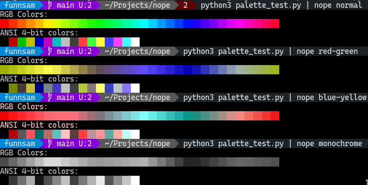

# Nope — a colorblind simulator
## Installing
```
cargo install --path=.
```
Note that it requires `cargo`.

## Usage (Unix-like)
```
<command> | nope [normal | red-green | blue-yellow | monochrome]
```

## Usage (Window)
well idk but redirect a command into its stdin

# Screenshots

